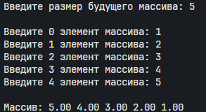

 Указатели, арифметика указателей
### Фролов Андрей, 1 курс, ИВТ-2
___
#### Задача 1
Внутри функции int main(void) { /*...*/ } определите указатель double *** pointer = NULL;. Инициализируйте этот указатель адресом другого указателя типа double ** , который указывает на переменную double * , которая указывает на double. Используйте pointer для записи и чтения значения 2.0 в сегмент оперативной памяти для double.
##### Математическая модель:
###### Формальная модель

**Определения:**

- $\mathcal{M}$ — выделение памяти (`malloc`)
- $\mathcal{F}$ — освобождение памяти (`free`)
- $p^{(n)}$ — указатель уровня $n$ ($p^{(0)} \in \mathbb{R}$)

**Иерархия:**

$$
p^{(3)} \to p^{(2)} \to p^{(1)} \to \underset{2.0}{p^{(0)}}
$$


**Операции:**

$$
\begin{align*}
\mathcal{M} &: 
\begin{cases}
p^{(3)} = \mathcal{M}(\text{sizeof}(p^{(2)})) \\
p^{(2)} = \mathcal{M}(\text{sizeof}(p^{(1)})) \\
p^{(1)} = \mathcal{M}(\text{sizeof}(p^{(0)}))
\end{cases} \\
\mathcal{F} &: 
\begin{cases}
\mathcal{F}(p^{(1)}) \\
\mathcal{F}(p^{(2)}) \\
\mathcal{F}(p^{(3)}) 
\end{cases}
\end{align*}
$$

**Инварианты:**

$$
\forall k \in \{1,2,3\} \quad p^{(k)} \neq \text{NULL} \text{ при } \mathcal{F}(p^{(k)})
$$


##### Список идентификаторов:

| Имя       | Тип          | Смысл                                    | Пример/Диапазон |
|-----------|--------------|------------------------------------------|-----------------|
| `p₃`      | `double***`  | Тройной указатель (базовый уровень)      | `0x7ff...`      |
| `p₂`      | `double**`   | Указатель на указатель (2 уровень)       | `0x5a2...`      |
| `p₁`      | `double*`    | Указатель на значение (1 уровень)        | `0x3bc...`      |
| `p₀`      | `double`     | Конечное значение в памяти               | `2.0`           |
| `M`       | `operator`   | Оператор выделения памяти (`malloc`)     | `M(sizeof(T))`  |
| `F`       | `operator`   | Оператор освобождения памяти (`free`)    | `F(ptr)`        |
| `Heap`    | `space`      | Область динамической памяти              | `0x000...0xFFFF`|
| `NULL`    | `const`      | Нулевой указатель                        | `0x0`           |

##### Код программы:
```c
#include <stdio.h>
#include <stdlib.h>

int main(void) {
    //Создаем тройной указатель и инициализируем NULL
    double ***pointer = NULL;
    
    //Выделяем память под double** (второй уровень)
    pointer = (double***)malloc(sizeof(double**));
    
    //Выделяем память под double* (первый уровень)
    *pointer = (double**)malloc(sizeof(double*));
    
    //Выделяем память под само double (значение)
    **pointer = (double*)malloc(sizeof(double));
    
    //Записываем значение 2.0
    ***pointer = 2.0;
    
    //Выводим значение
    printf("%lf\n", ***pointer);
    
    //Освобождаем память в обратном порядке
    free(**pointer); //освобождаем double
    free(*pointer);  //освобождаем double*
    free(pointer);   //освобождаем double**
    
    return 0;
}
```

##### Результат работы:

___
#### Задача 2
##### Математическая модель:
$$
*res = *a + *b
$$
##### Список идентификаторов:

| Имя  | Тип | Смысл                  |
| ---- | --- | ---------------------- |
| *res | int | указатель на результат |
| *a   | int | указатель на а         |
| *b   | int | указатель на б         |

##### Код программы:
```cpp
#include <stdlib.h>
#include <stdio.h>
#include <Windows.h>
#include <math.h>

int main(void)
{
    int *a = (int *)malloc(sizeof(int));
    int *b = (int *)malloc(sizeof(int));
    int *res = (int *)malloc(sizeof(int));
    SetConsoleOutputCP(CP_UTF8);
    printf("Введите первое число: ");
    scanf("%d", a);
    printf("Введите второе число: ");
    scanf("%d", b);
    *res = *a + *b;
    printf("Результат: %d", *res);
    free(a);
    free(b);
    free(res);
}
```

##### Результат работы: 

___
#### Задача 3
##### Математическая модель:

$$
\begin{align*}
a>b\to print(a)\\
b>a\to print(b)
\end{align*}
$$

##### Список идентификаторов:

| Имя | Тип | Смысл          |
| --- | --- | -------------- |
| *a  | int | указатель на a |
| *b  | int | указатель на b |

##### Код программы:
```cpp
#include <math.h>
#include <stdlib.h>
#include <stdio.h>
#include <Windows.h>

int main(void)
{
    SetConsoleOutputCP(CP_UTF8);

    int *a = (int *)malloc(sizeof(int));
    int *b = (int *)malloc(sizeof(int));

    printf("Введите первое число: ");
    scanf("%d", a);
    printf("Введите второе число: ");
    scanf("%d", b);

    if (*a > *b)
    {
        printf("Максимальное - a = %d", *a);
    }
    else
    {
        printf("Максимальное - b = %d", *b);
    }
    
    free(a);
    free(b);
}
```
##### Результат работы: 

___
#### Задача 4
##### Математическая модель:

$$
\begin{align*}

Массив = (p,\ n),\ где:\\
- p + i → A[i] \ для \ i ∈ [0, n-1]\\
- Все \ элементы \ хранятся \ подряд\
  
\end{align*}
$$

##### Список идентификаторов:

| Имя  | Тип | Смысл               |
| ---- | --- | ------------------- |
| *arr | int | динамический массив |
| size | int | размер массива      |
| i    | int | Параметр цикла      |

##### Код программы:
```cpp
#include <math.h>
#include <stdlib.h>
#include <stdio.h>
#include <Windows.h>

int main(void)
{
    SetConsoleOutputCP(CP_UTF8);
    
    int size;
    printf("Введите размер будущего массива: ");
    scanf("%d", &size);
    printf("\n");

    double *arr = (double*)malloc(size * sizeof(double));

    for(int i = 0; i < size;i ++)
    {
        printf("Введите %d элемент массива: ", i);
        scanf("%lf", (arr+i));
    }

    printf("\nМассив: ");
    for(int i = size-1; i >= 0; i--)
    {
        printf("%.2lf ", *(arr+i));
    }
    
    free(arr);
}
```

##### Результат работы: 

___
#### Задача 5
##### Математическая модель:

$A = (p, n)$ где:
- $p+i \rightarrow A_i$ (арифметика указателей)
- $p = M(n)$, $F(p)$ в конце
##### Список идентификаторов:

| Имя  | Тип    | Смысл                        |
| ---- | ------ | ---------------------------- |
| size | int    | Размер массива               |
| *ptr | double | указатель на элемент массива |
| *arr | double | массив                       |
| i    | int    | параметр цикла               |

##### Код программы:
```cpp
#include <math.h>
#include <stdlib.h>
#include <stdio.h>
#include <Windows.h>


    int main(void)
    {
        SetConsoleOutputCP(CP_UTF8);
    
        int size;
        printf("Введите размер будущего массива: ");
        scanf("%d", &size);
    
        double *arr = (double*)malloc(size * sizeof(double));
    
        double *ptr = arr;
        for(int i = 0; i < size;i ++)
        {
            printf("Введите %d элемент массива: ", i);
            scanf("%lf", ptr);
            ptr++;
        }
    
        ptr = arr+size;
        printf("Массив: ");
        for(int i = 0; i < size; i++)
        {
            ptr--;
            printf("%.2lf ", *ptr);
        }
        
        free(arr);
        free(ptr);
    }
```
##### Результат работы: 

___
#### Задача 6
##### Математическая модель:
$$ 
\begin{aligned}
&\text{Модель: } a \in \mathbb{Z},\ ptr = \&a \\
&\forall i \in [0,3]: \text{byte}_i = *(ptr + i) \in [0,255] \\
&\text{Порядок байт: little-endian (x86)}
\end{aligned}
$$
##### Список идентификаторов:

| Имя  | Тип  | Смысл                   |
| ---- | ---- | ----------------------- |
| a    | int  | переменная              |
| *ptr | char | указатель на переменную |
| i    | int  | параметр цикла          |

##### Код программы:
```cpp
#include <math.h>
#include <stdlib.h>
#include <stdio.h>
#include <Windows.h>

int main(void)
{
    SetConsoleOutputCP(CP_UTF8);

    int a = 1234567890;
    char *ptr = (char *)&a;

    printf("Побайтовый вывод переменной:\n");
    for(int i = 0; i < sizeof(a);i++)
    {
        printf("Байт%d: %02x\n",i,(unsigned char)ptr[i]);
    }
    free(ptr);
}
```
##### Результат работы: 

___
#### Задача 7
##### Математическая модель:
**Определения:**
- $p$: double** (указатель на массив указателей)
- $r$: rows, $c$: cols
- $\mathbb{M}$: malloc, $\mathbb{F}$: free

**Алгоритм:**
1. $p \leftarrow \mathbb{M}(r \times \text{sizeof}(\text{double*}))$
2. $\forall i \in [0,r-1]: p[i] \leftarrow \mathbb{M}(c \times \text{sizeof}(\text{double}))$
3. $\forall i \in [0,r-1]: \mathbb{F}(p[i])$
4. $\mathbb{F}(p)$

**Свойства:**
- Непрерывность внутри строки
- Строки могут быть разбросаны в памяти
- Размер: $8r + 8c$ байт (64-бит)
##### Список идентификаторов:

| Имя       | Тип    | Смысл            |
| --------- | ------ | ---------------- |
| **p_matix | double | двумерный массив |
| rows      | int    | кол-во рядов     |
| cols      | int    | кол-во столбцов  |

##### Код программы:
```cpp
#include <math.h>
#include <stdlib.h>
#include <stdio.h>
#include <Windows.h>

int main(void)
{
    SetConsoleOutputCP(CP_UTF8);

    double **p_matrix = NULL;
    int rows, cols;

    printf("Введите количество строк: ");
    scanf("%d",&rows);
    printf("Введите количество столбцов: ");
    scanf("%d",&cols);

    p_matrix = (double **)malloc(rows * sizeof(double*));

    for(int i = 0; i<rows;i++){
        p_matrix[i] = (double *)malloc(cols*sizeof(double));
    }

    for(int i = 0; i < rows; i++)
    {
        free(p_matrix[i]);
    }
    
    free(p_matrix);
}
```
##### Результат работы: 
