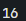
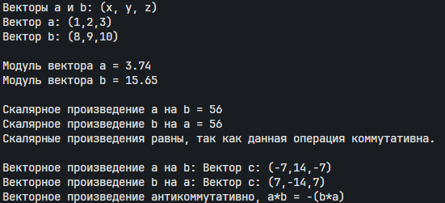
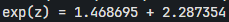
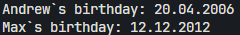
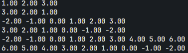
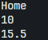
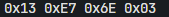
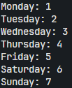
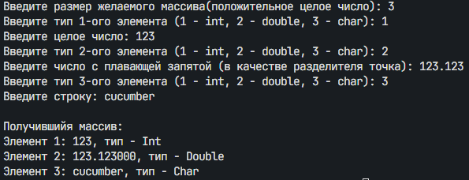

Структуры, объединения, перечисления.
### Фролов Андрей, 1 курс, ИВТ-2
___
#### Задача 1.1
Создать некоторую структуру с указателем на некоторую функцию в качестве поля. Вызвать эту функцию через имя переменной этой структуры и поле указателя на функцию.
##### Список идентификаторов:

| Имя | Тип        | Смысл                |
| --- | ---------- | -------------------- |
| add | int        | Функция сложения     |
| str | struct     | Структура            |
| str | struct str | Переменная структуры |

##### Код программы:
```c
#include <math.h>
#include <stdlib.h>
#include <stdio.h>


int add(int a,int b){
    return a + b;
}

struct str{
    int (*ptr)(int, int);
};

int main(void)
{
    struct str str = {add};
    printf("%d", str.ptr(8,8));
}
```
##### Результат работы: 

#### Задача 1.2
Создать структуру для вектора в 3-х мерном пространстве. Реализовать и использовать в своей программе следующие операции над векторами: 
• скалярное умножение векторов; 
• векторное произведение; 
• модуль вектора; 
• распечатка вектора в консоли.
В структуре вектора указать имя вектора в качестве отдельного поля этой структуры.
##### Математическая модель:
Вектор $\vec{v}$ в трёхмерном пространстве задаётся тремя координатами и именем:

$$
\vec{v} = (v_x, v_y, v_z), \quad \text{где имя} = \text{"v"}
$$

Скалярное произведение векторов $\vec{a} = (a_x, a_y, a_z)$ и $\vec{b} = (b_x, b_y, b_z)$:

$$
\vec{a} \cdot \vec{b} = a_x b_x + a_y b_y + a_z b_z
$$

Векторное произведение:

$$
\vec{a} \times \vec{b} = 
\begin{vmatrix}
\mathbf{i} & \mathbf{j} & \mathbf{k} \\
a_x & a_y & a_z \\
b_x & b_y & b_z
\end{vmatrix}
= (a_y b_z - a_z b_y)\mathbf{i} - (a_x b_z - a_z b_x)\mathbf{j} + (a_x b_y - a_y b_x)\mathbf{k}
$$

Модуль вектора:

$$
|\vec{v}| = \sqrt{v_x^2 + v_y^2 + v_z^2}
$$

Формат представления вектора:

$$
\text{name} = (x, y, z)
$$
##### Список идентификаторов:

| Имя           | Тип    | Смысл                                    |
| ------------- | ------ | ---------------------------------------- |
| Vector        | struct | Структура вектора                        |
| name[2]       | char   | Имя вектора                              |
| x             | int    | координата икс                           |
| y             | int    | координата игрек                         |
| z             | int    | координата зэд                           |
| Module        | double | функция находящая модуль вектора         |
| Dot_Product   | int    | функция находящая скалярное произведение |
| Cross_Product | Vector | функция находящая векторное произведение |
| print_vector  | void   | функция выводящая вектор на экран        |
| a             | Vector | Вектор а                                 |
| b             | Vector | Вектор б                                 |

##### Код программы:
```c
#include <math.h>
#include <stdlib.h>
#include <stdio.h>
#include <Windows.h>

typedef struct {
    char name[2];
    int x;
    int y;
    int z;
} Vector;

//Модуль (Длинна)
double Module(Vector a)
{
    return sqrt(a.x*a.x + a.y*a.y + a.z*a.z);
}

//Скалярное произведение
int Dot_Product(Vector a, Vector b){
    return a.x*b.x + a.y*b.y + a.z*b.z;
}

//Вектороное произведение
Vector Cross_Product(Vector a, Vector b){
    Vector result = {"c",a.y * b.z - a.z * b.y, a.z * b.x - a.x * b.z ,a.x * b.y -a.y * b.x};
    return result; 
}

//Вывод вектора
void print_vector(Vector a){
    printf("Вектор %s: (%d,%d,%d)\n",a.name, a.x, a.y, a.z);
}

int main(void)
{
    SetConsoleOutputCP(CP_UTF8);

    Vector a = {"a",1,2,3};
    Vector b = {"b",8,9,10};

    printf("Векторы a и b: (x, y, z)\n");
    print_vector(a);
    print_vector(b);
    printf("\n");
    printf("Модуль вектора %s = %.2lf\n", a.name, Module(a));
    printf("Модуль вектора %s = %.2lf\n", b.name, Module(b));
    printf("\n");
    printf("Скалярное произведение %s на %s = %d\n", a.name,b.name,Dot_Product(a,b));
    printf("Скалярное произведение %s на %s = %d\n", b.name,a.name,Dot_Product(b,a));
    printf("Скалярные произведения равны, так как данная операция коммутативна.\n");
    printf("\n");
    printf("Векторное произведение %s на %s: ",a.name, b.name);
    print_vector(Cross_Product(a,b));
    printf("Векторное произведение %s на %s: ",b.name, a.name);
    print_vector(Cross_Product(b,a));
    printf("Векторное произведение антикоммутативно, a*b = -(b*a)");
}

```
##### Результат работы: 

#### Задача 1.3
Вычислить, используя структуру комплексного числа, комплексную экспоненту exp(z) некоторого z ∈ C.
##### Математическая модель:
```math
\begin{align*}
\exp(z) &= 1 + z + \frac{1}{2!}z^2 + \frac{1}{3!}z^3 + \dots +\frac{1}{n!}z^n\\
\exp(z) &= \frac{\exp(z-1)*z}{n}
\end{align*}
```
##### Список идентификаторов:

| Имя                | Тип     | Смысл                                                      |
| ------------------ | ------- | ---------------------------------------------------------- |
| complex            | struct  | Структура комплексного числа                               |
| real               | double  | реальная часть                                             |
| imag               | double  | мнимая часть                                               |
| complex_add        | complex | сложение комплексных чисел                                 |
| complex_mult       | complex | умножение комплексных чисел                                |
| comples_div_scalar | complex | деление комплексного числа на константу                    |
| complex_exp        | complex | вычисление функции                                         |
| sum                | complex | переменная с начальным значением и для хранения результата |
| term               | complex | текущий член ряда                                          |
| n                  | int     | параметр цикла                                             |
| z                  | complex | число                                                      |
| ez                 | complex | вычисленная функция                                        |

##### Код программы:
```c
#include <math.h>
#include <stdlib.h>
#include <stdio.h>
#include <Windows.h>

typedef struct
{
    double real; // Действительная часть
    double imag; // Мнимая часть
} complex;

complex complex_add(complex a, complex b)
{
    complex res;
    res.real = a.real + b.real;
    res.imag = a.imag + b.imag;
    return res;
}

complex complex_mult(complex a, complex b)
{
    complex res;
    res.real = a.real * b.real - a.imag * b.imag;
    res.imag = a.real * b.imag + a.imag * b.real;
    return res;
}

complex complex_div_scalar(complex a, double scalar)
{
    complex res;
    res.real = a.real / scalar;
    res.imag = a.imag / scalar;
    return res;
}

complex complex_exp(complex z, int terms)
{
    complex sum = {1.0, 0.0};  // Начальное значение: 1 + 0i
    complex term = {1.0, 0.0}; // Текущий член ряда: z^n / n!

    for (int n = 1; n <= terms; n++)
    {
        term = complex_mult(term, z);       // *=z
        term = complex_div_scalar(term, n); // term /= n
        sum = complex_add(sum, term);       // sum +=term
    }

    return sum;
}

int main(void){
    complex z = {1.0,1.0};
    complex ez = complex_exp(z,10);

    printf("exp(z) = %.6lf + %.6lf", ez.real, ez.imag);
}
```
##### Результат работы: 


#### Задача 1.4
Используя так называемые "битовые" поля в структуре C, создать экономную структуру в оперативной памяти для заполнения даты некоторого события, например даты рождения человека
##### Список идентификаторов:

| Имя            | Тип          | Смысл                                                    |
| -------------- | ------------ | -------------------------------------------------------- |
| Birthday       | struct       | Структура дня рождения                                   |
| name[10]       | char         | имя человека                                             |
| day            | unsigned int | день                                                     |
| month          | unsigned int | месяц                                                    |
| year           | unsigned int | год                                                      |
| print_birthday | void         | функция вывода даты                                      |
| Andrew         | Birthday     | перменная для хранения данных о человеке по имени Andrew |
| Max            | Birthday     | перменная для хранения данных о человеке по имени Max    |

##### Код программы:
```c
#include <math.h>
#include <stdlib.h>
#include <stdio.h>

typedef struct {
    char name[10];
    unsigned int day : 5;
    unsigned int month : 4;
    unsigned int year : 11; 
} Birthday;

void print_birthday(Birthday Person){
    if(Person.month < 10){
        printf("%s`s birthday: %d.0%d.%d\n", Person.name, Person.day, Person.month, Person.year);   
    }
    else{
        printf("%s`s birthday: %d.%d.%d\n", Person.name, Person.day, Person.month, Person.year);   
    }
}
int main(void)
{
    Birthday Andrew = {"Andrew",20, 4, 2006};
    Birthday Max = {"Max", 12, 12, 2012};
    print_birthday(Andrew);
    print_birthday(Max);   
}
```
##### Результат работы: 

#### Задача 1.5
Реализовать в виде структур двунаправленный связный список и совершить отдельно его обход в прямом и обратном направлениях с распечаткой значений каждого элемента списка.
##### Список идентификаторов:
| Имя            | Тип     | Смысл                                |
| -------------- | ------- | ------------------------------------ |
| List           | struct  | структура элемента списка            |
| number         | double  | значение                             |
| next           | struct* | указатель на следющий элемент        |
| prev           | struct* | указатель на предыдущий элемент      |
| head           | struct* | элемент начала                       |
| tail           | struct* | элемент конца                        |
| add_end        | void    | функция добавляющая элемент в конец  |
| add_beginnig   | void    | функция добавляющая элемент в начало |
| print_forward  | void    | вывод с начала                       |
| print_backward | void    | вывод с конца                        |

##### Код программы:
```c
#include <stdlib.h>
#include <stdio.h>

typedef struct List{
    double number;

    struct List *next;
    struct List *prev;

} List;

void add_end(List **head, List **tail, double n){

    List *new_n = (List *)malloc(sizeof(List));
    new_n -> number = n;
    new_n -> next = NULL;
    new_n -> prev = NULL;

    if(*head == NULL){
       *head = new_n;
       *tail = new_n;
    } else {
        new_n -> prev = *tail;
        (*tail) -> next = new_n;
        *tail = new_n;
    }
}

void add_beginning(List **head, List **tail, double n){

    List *new_n = (List *)malloc(sizeof(List));
    new_n -> number = n;
    new_n -> next = NULL;
    new_n -> prev = NULL;

    if(*head == NULL){
       *head = new_n;
       *tail = new_n;
    } else {
        new_n -> next = *head;
        (*head) -> prev = new_n;
        *head = new_n;
    }
}

void print_forward(List *head){
    List* current = head;
    while(current!=NULL){
        printf("%.2lf ",current->number);
        current = current -> next;
    }
}

void print_backward(List *tail){
    List* current = tail;
    while(current!=NULL){
        printf("%.2lf ",current->number);
        current = current -> prev;
    }
}

int main(void){
    List *head = NULL;
    List *tail = NULL;

    add_end(&head, &tail, 1);
    add_end(&head, &tail, 2);
    add_end(&head, &tail, 3);

    print_forward(head);
    printf("\n");
    print_backward(tail);
    printf("\n");

    add_beginning(&head, &tail, 0);
    add_beginning(&head, &tail, -1);
    add_beginning(&head, &tail, -2);

    print_forward(head);
    printf("\n");
    print_backward(tail);
    printf("\n");

    add_end(&head, &tail, 4);
    add_end(&head, &tail, 5);
    add_end(&head, &tail, 6);

    print_forward(head);
    printf("\n");
    print_backward(tail);
    printf("\n");
}
```
##### Результат работы: 

#### Задача 2.1
Напишите программу, которая использует указатель на некоторое объединение union.
##### Список идентификаторов:
| Имя    | Тип    | Смысл                    |
| ------ | ------ | ------------------------ |
| Var    | union  | объединение              |
| ch[10] | char   | символы                  |
| i      | int    | число инт                |
| d      | double | число дабл               |
| ptr    | Var*   | указатель на объединение |

##### Код программы:
```c
#include <stdlib.h>
#include <stdio.h>
#include <string.h>


typedef union 
{
    char ch[10];
    int i;
    double d;
} Var;


int main(void)
{
    Var *ptr = (Var *)malloc(sizeof(Var));
    strcpy(ptr->ch, "Home");
    printf("%s\n", ptr->ch);
    ptr->i = 10;
    printf("%d\n", ptr->i);
    ptr->d = 15.5;
    printf("%.1lf\n", ptr->d);
    free(ptr);
}
```
##### Результат работы: 

#### Задача 2.2
Напишите программу, которая использует union для побайтовой распечатки типа unsigned long.
##### Список идентификаторов:
| Имя          | Тип           | Смысл                      |
| ------------ | ------------- | -------------------------- |
| number       | union         | Объединие                  |
| number.n     | unsigned long | переменная, хранящая число |
| number.bytes | unsigned char | переменная, хранящая байты |
| n            | number        | переменная типа Number     |
| i            | int           | параметр цикла             |
##### Код программы:
```c
#include <stdlib.h>
#include <stdio.h>
#include <string.h>


typedef union 
{
    unsigned long n;
    unsigned char bytes[sizeof(unsigned long)];
} number;


int main(void)
{
    number n;
    n.n = 57599763;
    for(int i = 0; i < sizeof(n.bytes)/sizeof(unsigned char); i++){
        printf("0x%02X ", n.bytes[i]);
    }
}
```
##### Результат работы: 

#### Задача 2.3
Создайте перечислимый тип данных (enum) для семи дней недели и распечатайте на экране его значения, как целые числа.
##### Список идентификаторов:
| Имя      | Тип  | Смысл                    |
| -------- | ---- | ------------------------ |
| WeekDays | enum | Перечисление дней недели |
##### Код программы:
```c
#include <stdlib.h>
#include <stdio.h>
#include <string.h>


enum WeekDays{
    MONDAY = 1, TUESDAY, WEDNESDAY, THURSDAY, FRIDAY, SATURDAY, SUNDAY
};


int main(void)
{
    printf("Monday: %d\n", MONDAY);
    printf("Tuesday: %d\n", TUESDAY);
    printf("Wednesday: %d\n", WEDNESDAY);
    printf("Thursday: %d\n", THURSDAY);
    printf("Friday: %d\n", FRIDAY);
    printf("Saturday: %d\n", SATURDAY);
    printf("Sunday: %d", SUNDAY);
}
```
##### Результат работы: 

#### Задача 2.4
Создайте так называемое размеченное объединение union, которое заключено в виде поля структуры struct вместе с ещё одним полем, которое является перечислением enum и служит индикатором того, что именно на текущий момент хранится в таком вложенном объединении. Создать и заполнить динамический массив таких структур с объединениями внутри, заполняя вспомогательное поле перечисления enum для сохранения информации о хранимом в каждом размеченном объединении типе данных. Реализовать распечатку данных массива таких структур в консоль.

| Имя              | Тип       | Смысл                                                                       |
| ---------------- | --------- | --------------------------------------------------------------------------- |
| types            | enum      | Перечисление типов                                                          |
| value            | union     | Объединения для значения разных типов данных                                |
| value.char_n[52] | char      | переменная для символов                                                     |
| value.int_n      | int       | переменная для инта                                                         |
| value.double_n   | double    | переменная для дабл                                                         |
| Data             | struct    | структура элемента                                                          |
| Data.n           | var_value | значение                                                                    |
| Data.n_type      | type      | тип значения                                                                |
| n                | int       | количество элементов массива                                                |
| var              | int       | переменная, получаемая от пользователя, позволяющая правильно ввести данные |
| array            | Data*     | массив элементов Data                                                       |

##### Код программы:
```c
#include <stdlib.h>
#include <stdio.h>
#include <string.h>
#include <Windows.h>


typedef enum types{
    var_int, var_double, var_char
} type;

typedef union value{
    char char_n[52];
    int int_n;
    double double_n;
} var_value;

typedef struct {
    var_value n;
    type n_type;
} Data;

int main(void)
{
    SetConsoleOutputCP(CP_UTF8);

    int n, var;
    printf("Введите размер желаемого массива(положительное целое число): ");
    scanf("%d", &n);
    Data *array = (Data *)malloc(sizeof(Data) * n);

    //Заполнение массива
    for(int i = 0; i < n; i++){

        printf("Введите тип %d-ого элемента (1 - int, 2 - double, 3 - char): ", i + 1);
        scanf("%d", &var);

        switch (var)
        {
        case 1:
            (array+i)->n_type = var_int;
            printf("Введите целое число: ");
            scanf("%d", &(array+i)->n.int_n);
            break;
        case 2:
            (array+i)->n_type = var_double;
            printf("Введите число с плавающей запятой (в качестве разделителя точка): ");
            scanf("%lf", &(array+i)->n.double_n);
            break;
        case 3:
            (array+i)->n_type = var_char;
            printf("Введите строку: ");
            scanf("%51s", &(array+i)->n.char_n);
            break;
        default:
            printf("Неверный тип. Введите 1 для int, 2 для double или 3 для char.\n");
            i--; 
            break;
    }
}

    //Вывод массива
    printf("\nПолучившийя массив:\n");
    for (int i = 0; i < n; i++)
    {
        switch ((array+i)->n_type)
        {
        case var_int:
            printf("Элемент %d: %d, тип - Int\n",i+1,(array+i)->n.int_n);
            break;
        case var_double:
            printf("Элемент %d: %lf, тип - Double\n",i+1,(array+i)->n.double_n);
            break;
        case var_char:
            printf("Элемент %d: %s, тип - Char\n",i+1,(array+i)->n.char_n);
            break;
        }
    }
    free(array);   
}
```
##### Результат работы: 

