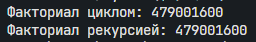
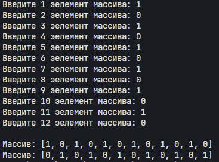
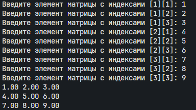
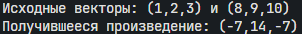
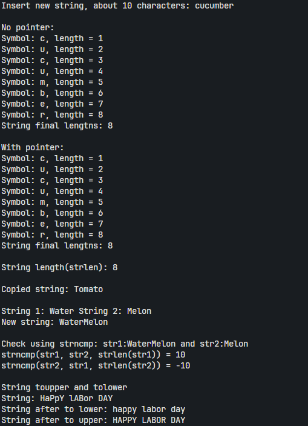
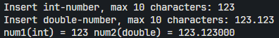

Функции, строки.
### Фролов Андрей, 1 курс, ИВТ-2
___
#### Задача 1.1
Создайте две функции, которые вычисляют факториал числа: • функцию, которая вычисляет факториал, используя цикл; • функцию, которая вычисляет факториал, используя рекурсивный вызов самой себя.
##### Математическая модель:
```math
n! = 1*2*3*\dots*n
```
##### Список идентификаторов:
| Имя             | Тип | Смысл               |
| --------------- | --- | ------------------- |
| cycle_fact      | int | Факториал циклом    |
| n               | int | число               |
| res             | int | результат           |
| recoursion_fact | int | факториал рекурсией |
| n               | int | число               |
| i               | int | параметр цикла      |
##### Код программы:
```c
#include <math.h>
#include <stdio.h>
#include <Windows.h>

int cycle_fact(int n){
    int res = 1;
    for(int i = 2; i <= n; i++){
        res *= i;
    }
    return res;
}

int recursion_fact (int n){
	if(n<=0){
	printf("n is supposed to be > 0");
	return 0;
	}
    if (n == 1){return 1;} 
    return recursion_fact(n-1)*n;
}

int main(void)
{
    SetConsoleOutputCP(CP_UTF8);
    printf("Факториал циклом: %d\n", cycle_fact(12));
    printf("Факториал рекурсией: %d\n", recursion_fact(12));
};
```
##### Результат работы: 

#### Задача 1.2
Объявите указатель на массив типа int и динамически выделите память для 12-ти элементов. Напишите функцию, которая поменяет значения чётных и нечётных ячеек массива.
##### Список идентификаторов:
| Имя       | Тип  | Смысл                             |
| --------- | ---- | --------------------------------- |
| swap      | void | Функция меняющая элементы местами |
| print_arr | void | функция выводящая массив          |
| n         | int  | количество элементов              |
| arr       | int* | массив                            |
##### Код программы:
```c
#include <math.h>
#include <stdlib.h>
#include <stdio.h>
#include <Windows.h>

void swap(int *arr, int n){
    for(int i = 0; i < n; i+=2){
        arr[i] ^= arr[i+1];
        arr[i+1] ^= arr[i];
        arr[i] ^= arr[i+1];
    }
}

void print_array(int *arr, int n){
    printf("Массив: [");
    for(int i = 0; i < n; i++){
        if(i == n-1){
            printf("%d]",arr[i]);
            break;
        }
        printf("%d, ", arr[i]);
    }
    printf("\n");
}

int main(void)
{
    SetConsoleOutputCP(CP_UTF8);
    int n = 12;
    int *arr = (int *)malloc(sizeof(int)*n);

    for(int i = 0; i < n; i++){
        printf("Введите %d эелемент массива: ",i+1);
        scanf("%d",(arr+i));
    }
    printf("\n");
    
    print_array(arr, n);
    swap(arr, n);
    print_array(arr, n);
    free(arr);
};
```
##### Результат работы: 

#### Задача 1.3
Создать две основные функции: 
•функцию для динамического выделения памяти под двумерный динамический массив типа double — матрицу; 
• функцию для динамического освобождения памяти под двумерный динамический массив типа double — матрицу. Создать две вспомогательные функции: 
• функцию для заполнения матрицы типа double; 
• функцию для распечатки этой матрицы на экране. Продемонстрировать работу всех этих функций в своей программе.
##### Список идентификаторов:
| Имя                | Тип      | Смысл                |
| ------------------ | -------- | -------------------- |
| memory_for_matrix  | double** | Выделение памяти     |
| free_matrix_memory | void     | освобождение матрицы |
| fill_matrix        | void     | заполнение           |
| print_matrix       | void     | вывод матрицы        |
| rows               | int      | строки               |
| cols               | int      | столбцы              |
| matrix             | double** | Матрица              |
##### Код программы:
```c
#include <math.h>
#include <stdlib.h>
#include <stdio.h>
#include <Windows.h>

double** memory_for_matrix(int rows, int cols){
    double **matrix = (double **)malloc(sizeof(double *)*rows);
    for (int i = 0; i < rows; i++)
    {
        matrix[i] = (double *)malloc(sizeof(double) * cols);
    }
    return matrix;
}

void free_matrix_memory(double **matrix,int rows){
    for (int i = 0; i < rows; i++)
    {
        free(matrix[i]);
    }
    free(matrix);
}

void fill_matrix(double** matrix, int rows, int cols){
    for (int i = 0; i < rows; i++)
    {
        for (int j = 0; j < cols; j++)
        {
            printf("Введите элемент матрицы с индексами [%d][%d]: ",i+1,j+1);
            scanf("%lf", &matrix[i][j]);
        }
    }
    
}

void print_matrix(double** matrix,int rows,int cols){
    for (int i = 0; i < rows; i++) {
        for (int j = 0; j < cols; j++) {
            printf("%.2f ", matrix[i][j]);
        }
        printf("\n");
    }
}

int main(void)
{
    SetConsoleOutputCP(CP_UTF8);
    int rows = 3; int cols = 3;
    double** matrix = memory_for_matrix(rows,cols);
    fill_matrix(matrix, rows, cols);
    print_matrix(matrix, rows, cols);
    free_matrix_memory(matrix, rows);
};
```
##### Результат работы: 

#### Задача 1.4
Создать функцию, которая вычисляет векторное произведение двух векторов в декартовых координатах, используя указатели на соответствующие массивы.
##### Математическая модель:
$$
 \vec{a}(a_{1},a_{2},a_{3}) * \vec{b}(b_{1},b_{2},b_{3}) = \vec{c}(a_{2}b_{3}-a_{3}b_{2},a_{3}b_{1}-a_{1}b_{3},a_{1}b_{2}-a_{2}b_{1})
$$
##### Список идентификаторов:
| Имя           | Тип   | Смысл                |
| ------------- | ----- | -------------------- |
| Cross_Product | void  | функция произведения |
| vector1       | int[] | 1 вектор             |
| vector2       | int[] | 2 вектор             |
| result        | int[] | 3 вектор             |
##### Код программы:
```c
#include <math.h>
#include <stdlib.h>
#include <stdio.h>
#include <Windows.h>

void Cross_Product(int* vec1, int* vec2, int* result){
    result[0] = vec1[1]*vec2[2] - vec1[2]*vec2[1];
    result[1] = vec1[2]*vec2[0] - vec1[0]*vec2[2];
    result[2] = vec1[0]*vec2[1] - vec1[1]*vec2[0];
}

int main(void)
{
    SetConsoleOutputCP(CP_UTF8);
    int vector1[] = {1, 2, 3};
    int vector2[] = {8, 9, 10};
    int result[3];
    printf("Исходные векторы: (%d,%d,%d) и (%d,%d,%d)\n", vector1[0],vector1[1],vector1[2],vector2[0],vector2[1],vector2[2]);
    Cross_Product(vector1,vector2,result);
    printf("Получившееся произведение: (%d,%d,%d)", result[0],result[1],result[2]);
}
```
##### Результат работы: 

#### Задача 2.1
Создайте новую программу, где с клавиатуры вводится строка некоторой длины порядка 10 латинских символов (не используйте кириллицу) в классическую строку языка C, которая имеет вид массива
char my_string[MY_SIZE]. MY_SIZE определите с помощью директивы #define. Значение MY_SIZE должно превышать длину вводимой
строки с некоторым разумным запасом. Другие строки в этой задаче
можете создавать либо также как статические массивы, либо как динамические массивы, но не забывайте освобождать от динамически
выделенную память с помощью функции
void free(void∗ ptr); .
Выполните следующие действия и распечатайте результаты:
1. Вычислите длину строки my_string, используя цикл for и тот
факт, что в языкеC такие строки имеют в конце специальный нулевой символ конца строки, представленный escape-последовательностью
'\0' ('...' — это тип char).
2. Сделайте тоже самое, что в пункте 1, но создайте указатель на
начало вашей строки и используйте операцию инкремента ++.
3. Используйте функции
size_t strlen(const char∗ str); или
size_t strnlen (const char ∗string, size_t maxlen); или
size_t strnlen_s(const char ∗str, size_t strsz); для получения размера строки в виде значения size_t (псевдоним
unsigned int, спецификатор форматирования —"%zu"). Убедитесь, что ваш компилятор явно работает с опцией-std=c11 или с
опцией для более позднего стандарта языка для поддержки функции strnlen_s.
4. Создайте вторую строку (второй массив) и скопируйте в неё строку my_string, используя функцию
char ∗strcpy(char ∗dest, const char ∗src); или
char ∗strncpy (char ∗dest, const char ∗src, size_t n);.
5. Создайте ещё две строки какого-либо размера и задайте их прямо
в коде без клавиатуры. Сделайте конкатенацию этих двух строк,
используя
char ∗strcat(char ∗dest, const char ∗src); или
char ∗strncat(char ∗dest, const char ∗src, size_t n);. Первую
строку трактуйте как dest (destination) и подберите размер этого
массива с запасом.
6. Сравните две новые строки, заданные в коде строковыми литералами, используя функцию
int strcmp(const char ∗lhs, const char ∗rhs); или
int strncmp (const char ∗s1, const char ∗s2, size_t n).
7. Задайте прямо в коде строку, в которой есть только латинские
символы в верхнем и нижнем регистре. Переведите строку полностью в нижний регистр и отдельно полностью в верхний регистр. Распечатайте каждый результат отдельно. Найдите сигнатуры подходящих функций (tolower и toupper), изучив базовые
однобайтовые строковые функции по ссылке
https://en.cppreference.com/w/c/string/byte.
##### Список идентификаторов:
| Имя        | Тип   | Смысл  |
| ---------- | ----- | ------ |
| MY_SIZE    | const | размер |
| length     | int   | длинна |
| my_string  | char  | строка |
| my_string1 | char  | строка |
| my_string2 | char  | строка |
| my_string3 | char  | строка |
| new_string | char  | строка |
| check      | char  | строка |
##### Код программы:
```c
#include <string.h>
#include <stdlib.h>
#include <stdio.h>
#include <ctype.h>

#define MY_SIZE 15

int main(void){
    // Вводим строку и удаялем \n
    char my_string[MY_SIZE];
    printf("Insert new string, about 10 characters: ");
    fgets(my_string, MY_SIZE, stdin);
    my_string[strcspn(my_string, "\n")] = '\0';

    //1. Считаем длинну без указателя
    int length = 0;
    printf("\nNo pointer:\n");
    for(int i = 0; my_string[i]!='\0'; i++){
        length++;
        printf("Symbol: %c, length = %d\n", my_string[i], length);
    }
    printf("String final lengtns: %d\n", length);


    //2. Считаем длинну через указатель
    printf("\nWith pointer:\n");
    length = 0;
    char *my_string_ptr = my_string;
    for(int i = 0; my_string_ptr[i]!='\0'; i++){
        length++;
        printf("Symbol: %c, length = %d\n", my_string_ptr[i], length);
    }
    printf("String final lengtns: %d\n", length);
    free(my_string_ptr);

    //3. Получаем длинну строки через функции
    length = strlen(my_string);
    printf("\nString length(strlen): %d\n",length);

    //4. Создаем новую строку и копируем ее в старую
    char my_string1[] = "Tomato";
    strcpy(my_string,my_string1);
    printf("\nCopied string: %s\n", my_string);

    //5. Создаем еще 2 строки и делаем конкатенацию
    char my_string2[12] = "Water";
    char my_string3[] = "Melon";
    printf("\nString 1: %s String 2: %s\n",my_string2,my_string3);
    strncat(my_string2, my_string3,sizeof(my_string2)-strlen(my_string2)-1);
    printf("New string: %s\n", my_string2);

    //6. Сравниваем две новые строки заданные строковыми литералами
    printf("\nCheck using strncmp: str1:%s and str2:%s\n",my_string2, my_string3);
    int check = strncmp(my_string2, my_string3, strlen(my_string2));
    printf("strncmp(str1, str2, strlen(str1)) = %d\n", check);
    check = strncmp(my_string3, my_string2, strlen(my_string3));
    printf("strncmp(str2, str1, strlen(str2)) = %d\n", check);
    
    //7. Новая строка в нижний и верхний регист отдельно
    printf("\nString toupper and tolower\n");
    char new_string[] = "HaPpY lABor DAY";
    printf("String: %s\n",new_string);
    for(int i = 0; new_string[i] != '\0'; i++){
        new_string[i] = tolower(new_string[i]);
    }
    printf("String after to lower: %s\n",new_string);
    for(int i = 0; new_string[i] != '\0'; i++){
        new_string[i] = toupper(new_string[i]);
    }
    printf("String after to upper: %s",new_string);
}
```
##### Результат работы: 

#### Задача 2.2
Конвертируйте введённые заданные как строки: число с плавающей точкой (double) и целое число (int) в значения типаdouble и int, используя функциями atof и atoi.
##### Список идентификаторов:
| Имя  | Тип    | Смысл    |
| ---- | ------ | -------- |
| size | const  | Размер   |
| str1 | char   | строка 1 |
| str2 | char   | строка 2 |
| num1 | int    | число 1  |
| num2 | double | число 2  |
##### Код программы:
```c
#include <stdio.h>
#include <stdlib.h>

#define size 12

int main(void){

    char *str1 = (char *)malloc(sizeof(char)*size);
    char *str2 = (char *)malloc(sizeof(char)*size);
    printf("Insert int-number, max 10 characters: ");
    fgets(str1, size, stdin);
    printf("Insert double-number, max 10 characters: ");
    fgets(str2, size, stdin);

    int num1 = atoi(str1);
    free(str1);
    double num2 = atof(str2);
    free(str2);

    printf("num1(int) = %d num2(double) = %lf", num1, num2);
}
```
##### Результат работы: 

#### Задача 1.1
Создайте строку от 10 до 20 символов, используя только цифры, латинский буквы в разных регистрах пробельные символы и символы пунктуации. Организуйте цикл, где каждый символ подробно тестируется функциями типа int is∗(/∗... ∗/) (например — isdigit, ispunct). Оформите распечатку информации по каждому символу в виде списка на экране, чтобы можно было прочесть информацию о том что представляет из себя 4 каждый символ (своими словами, в свободной форме). Постарайтесь использовать только латиницу.
##### Список идентификаторов:
| Имя    | Тип    | Смысл  |
| ------ | ------ | ------ |
| string | char[] | Строка |
##### Код программы:
```c
#include <stdio.h>
#include <ctype.h>

int main(void){
    char srting[] = "A1b2 C3d4!E5f, G6?";

    for(int i = 0; srting[i] != '\0'; i++){
        printf("Symbol: %c\n", srting[i]);
        printf("isalnum: %s", (isalnum(srting[i]) == 0 ? "No\n" : "Yes\n" ));
        printf("isaplha: %s", (isalpha(srting[i]) == 0 ? "No\n" : "Yes\n" ));
        printf("islower: %s", (islower(srting[i]) == 0 ? "No\n" : "Yes\n" ));
        printf("isupper: %s", (isupper(srting[i]) == 0 ? "No\n" : "Yes\n" ));
        printf("isdigit: %s", (isdigit(srting[i]) == 0 ? "No\n" : "Yes\n" ));
        printf("isxdigit: %s", (isxdigit(srting[i]) == 0 ? "No\n" : "Yes\n" ));
        printf("iscntrl: %s", (iscntrl(srting[i]) == 0 ? "No\n" : "Yes\n" ));
        printf("isgraph: %s", (isgraph(srting[i]) == 0 ? "No\n" : "Yes\n" ));
        printf("isspace: %s", (isspace(srting[i]) == 0 ? "No\n" : "Yes\n" ));
        printf("isblank: %s", (isblank(srting[i]) == 0 ? "No\n" : "Yes\n" ));
        printf("isprint: %s", (isprint(srting[i]) == 0 ? "No\n" : "Yes\n" ));
        printf("ispunct: %s", (ispunct(srting[i]) == 0 ? "No\n\n" : "Yes\n\n" ));
    }
}   
```
##### Результат работы: 
```
Symbol: A
isalnum: Yes
isaplha: Yes
islower: No
isupper: Yes
isdigit: No
isxdigit: Yes
iscntrl: No
isgraph: Yes
isspace: No
isblank: No
isprint: Yes
ispunct: No

Symbol: 1
isalnum: Yes
isaplha: No
islower: No
isupper: No
isdigit: Yes
isxdigit: Yes
iscntrl: No
isgraph: Yes
isspace: No
isblank: No
isprint: Yes
ispunct: No

Symbol: b
isalnum: Yes
isaplha: Yes
islower: Yes
isupper: No
isdigit: No
isxdigit: Yes
iscntrl: No
isgraph: Yes
isspace: No
isblank: No
isprint: Yes
ispunct: No

Symbol: 2
isalnum: Yes
isaplha: No
islower: No
isupper: No
isdigit: Yes
isxdigit: Yes
iscntrl: No
isgraph: Yes
isspace: No
isblank: No
isprint: Yes
ispunct: No

Symbol:
isalnum: No
isaplha: No
islower: No
isupper: No
isdigit: No
isxdigit: No
iscntrl: No
isgraph: No
isspace: Yes
isblank: Yes
isprint: Yes
ispunct: No

Symbol: C
isalnum: Yes
isaplha: Yes
islower: No
isupper: Yes
isdigit: No
isxdigit: Yes
iscntrl: No
isgraph: Yes
isspace: No
isblank: No
isprint: Yes
ispunct: No

Symbol: 3
isalnum: Yes
isaplha: No
islower: No
isupper: No
isdigit: Yes
isxdigit: Yes
iscntrl: No
isgraph: Yes
isspace: No
isblank: No
isprint: Yes
ispunct: No

Symbol: d
isalnum: Yes
isaplha: Yes
islower: Yes
isupper: No
isdigit: No
isxdigit: Yes
iscntrl: No
isgraph: Yes
isspace: No
isblank: No
isprint: Yes
ispunct: No

Symbol: 4
isalnum: Yes
isaplha: No
islower: No
isupper: No
isdigit: Yes
isxdigit: Yes
iscntrl: No
isgraph: Yes
isspace: No
isblank: No
isprint: Yes
ispunct: No

Symbol: !
isalnum: No
isaplha: No
islower: No
isupper: No
isdigit: No
isxdigit: No
iscntrl: No
isgraph: Yes
isspace: No
isblank: No
isprint: Yes
ispunct: Yes

Symbol: E
isalnum: Yes
isaplha: Yes
islower: No
isupper: Yes
isdigit: No
isxdigit: Yes
iscntrl: No
isgraph: Yes
isspace: No
isblank: No
isprint: Yes
ispunct: No

Symbol: 5
isalnum: Yes
isaplha: No
islower: No
isupper: No
isdigit: Yes
isxdigit: Yes
iscntrl: No
isgraph: Yes
isspace: No
isblank: No
isprint: Yes
ispunct: No

Symbol: f
isalnum: Yes
isaplha: Yes
islower: Yes
isupper: No
isdigit: No
isxdigit: Yes
iscntrl: No
isgraph: Yes
isspace: No
isblank: No
isprint: Yes
ispunct: No

Symbol: ,
isalnum: No
isaplha: No
islower: No
isupper: No
isdigit: No
isxdigit: No
iscntrl: No
isgraph: Yes
isspace: No
isblank: No
isprint: Yes
ispunct: Yes

Symbol:
isalnum: No
isaplha: No
islower: No
isupper: No
isdigit: No
isxdigit: No
iscntrl: No
isgraph: No
isspace: Yes
isblank: Yes
isprint: Yes
ispunct: No

Symbol: G
isalnum: Yes
isaplha: Yes
islower: No
isupper: Yes
isdigit: No
isxdigit: No
iscntrl: No
isgraph: Yes
isspace: No
isblank: No
isprint: Yes
ispunct: No

Symbol: 6
isalnum: Yes
isaplha: No
islower: No
isupper: No
isdigit: Yes
isxdigit: Yes
iscntrl: No
isgraph: Yes
isspace: No
isblank: No
isprint: Yes
ispunct: No

Symbol: ?
isalnum: No
isaplha: No
islower: No
isupper: No
isdigit: No
isxdigit: No
iscntrl: No
isgraph: Yes
isspace: No
isblank: No
isprint: Yes
ispunct: Yes
```
