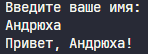
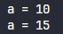
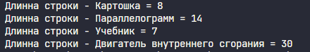
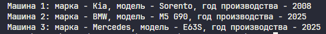
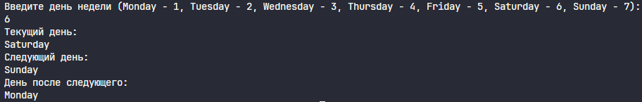
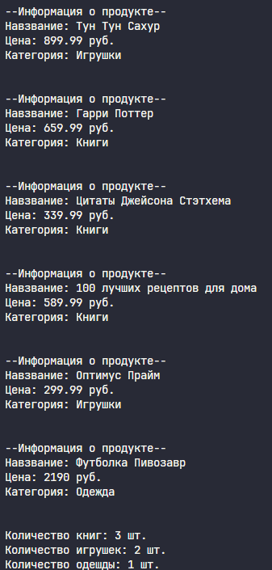

#### Задача 1
Напишите программу, которая запрашивает у пользователя имя и выводит на экран приветственное сообщение с использованием этого имени.
##### Список идентификаторов:
| Имя  | Тип    | Смысл |
| ---- | ------ | ----- |
| name | String | Имя   |
##### Код программы:
```rust
use std::io;

fn main() {
    let mut name = String::new();
    println!("Введите ваше имя: ");

    io::stdin()
        .read_line(&mut name)
        .expect("Ошибка при чтении строки");
    
    let name = name.trim();

    println!("Привет, {}!", name);
}
```
##### Результат работы: 

#### Задача 2
Создайте переменную типа целое беззнаковое число и выведите ее значение на экран. Явно укажите тип переменной. Затем измените значение переменной и снова выведите его.
##### Математическая модель:
$$result = a+b$$
##### Список идентификаторов:
| Имя | Тип | Смысл |
| --- | --- | ----- |
| a   | u32 | число |
##### Код программы:
```rust
fn main() {
    let a: u32 = 10;
    println!("a = {}", a);
    let a = 15;
    println!("a = {}", a);
}
```
##### Результат работы: 

#### Задача 3
Напишите функцию, которая принимает строку и возвращает ее длину (количество символов). Затем вызовите эту функцию с различными строками.
##### Код программы:
```rust
fn str_length(string: &str) -> usize{
    string.chars().count()
}

fn main() {
    print!("Длинна строки - Картошка = {}\n", str_length("Картошка"));
    print!("Длинна строки - Параллелограмм = {}\n", str_length("Параллелограмм"));
    print!("Длинна строки - Учебник = {}\n", str_length("Учебник"));
    print!("Длинна строки - Двигатель внутреннего сгорания = {}\n", str_length("Двигатель внутреннего сгорания"));
}
```
##### Результат работы:

#### Задача 4
Задайте структуру Car с полями brand, model и year, и создайте несколько экземпляров этой структуры. Выведите информацию о каждой машине на экран.
##### Список идентификаторов:
| Имя         | Тип        | Смысл       |
| ----------- | ---------- | ----------- |
| Cat         | Struct     | Машина      |
| car.brang   | String     | марка       |
| car.model   | String     | модель      |
| car.year    | usize      | Год выпуска |
| car_(1,2,3) | struct car | экземпляры  |
##### Код программы:
```rust
struct Car{
    brand: String,
    model: String,
    year: usize
}

fn main(){
    let car_1 = Car{
        brand: "Kia".to_string(),
        model: "Sorento".to_string(),
        year: 2008
    };

    let car_2 = Car{
        brand: "BMW".to_string(),
        model: "M5 G90".to_string(),
        year: 2025
    };

    let car_3 = Car{
        brand: "Mercedes".to_string(),
        model: "E63S".to_string(),
        year: 2023
    };

    println!("Машина 1: марка - {}, модель - {}, год производства - {}", car_1.brand, car_1.model, car_1.year);
    println!("Машина 2: марка - {}, модель - {}, год производства - {}", car_2.brand, car_2.model, car_2.year);
    println!("Машина 3: марка - {}, модель - {}, год производства - {}", car_3.brand, car_3.model, car_3.year);
}

```
##### Результат работы: 

#### Задача 5
Напишите программу, которая запрашивает у пользователя число 𝑁 и выводит на экран 𝑁­ое число Фибоначчи. Используйте рекурсию для решения этой задачи.
##### Код программы:
```rust
fn fibonachi(n: i32) -> i32{
    if n == 1{
        0
    } else if n == 2{
        1
    } else {
        fibonachi(n-1)+fibonachi(n-2)
    }
}

fn main(){
    println!("6 число ряда фибоначи: {}", fibonachi(6));
    println!("10 число ряда фибоначи: {}", fibonachi(10));
    println!("11 число ряда фибоначи: {}", fibonachi(11));
}
```
##### Результат работы: 

#### Задача 6
Реализуйте перечисление DayOfWeek для дней недели. Напишите функцию, которая принимает день недели и возвращает следующий день. Обработайте случаи перехода на следующий день недели, если текущий день – воскресенье.
##### Список идентификаторов:
| Имя       | Тип       | Смысл           |
| --------- | --------- | --------------- |
| DayOfWeek | enum      | дни недели      |
| input     | String    | вводимое число  |
| id        | u8        | input -> u8     |
| day       | DayOfWeek | день недели     |
| next      | DayOfWeek | след день       |
| next_next | DayOfWeek | день после след |
##### Код программы:
```rust
use std::io;

enum  DayOfWeek{
    Monday,
    Tuesday,
    Wednesday,
    Thursday,
    Friday,
    Saturday,
    Sunday
}

fn next_day(day: &DayOfWeek)->DayOfWeek{
    match *day {
        DayOfWeek::Monday => DayOfWeek::Tuesday,
        DayOfWeek::Tuesday =>  DayOfWeek::Wednesday,
        DayOfWeek::Wednesday =>  DayOfWeek::Thursday,
        DayOfWeek::Thursday =>  DayOfWeek::Friday, 
        DayOfWeek::Friday =>  DayOfWeek::Saturday,
        DayOfWeek::Saturday =>  DayOfWeek::Sunday,
        DayOfWeek::Sunday =>  DayOfWeek::Monday
    }
}

fn print_day(day: &DayOfWeek){
    match *day {
        DayOfWeek::Monday => println!("Monday"),
        DayOfWeek::Tuesday => println!("Tuesday"),
        DayOfWeek::Wednesday => println!("Wednesday"),
        DayOfWeek::Thursday => println!("Thursday"), 
        DayOfWeek::Friday => println!("Friday"),
        DayOfWeek::Saturday => println!("Saturday"),
        DayOfWeek::Sunday => println!("Sunday")
    }
}

fn main(){
    let mut input = String::new();
    println!("Введите день недели\n 
    (Monday - 1, Tuesday - 2, Wednesday - 3, Thursday - 4, Friday - 5, Saturday - 6, Sunday - 7): ");

    io::stdin()
        .read_line(&mut input)
        .expect("Ошибка чтения строки!");
    let id: u8 = input.trim().parse().expect("Введено не число!");
    
    let  day = match id {
        1 => DayOfWeek::Monday,
        2 => DayOfWeek::Tuesday,
        3 => DayOfWeek::Wednesday,
        4 => DayOfWeek::Thursday,
        5 => DayOfWeek::Friday,
        6 => DayOfWeek::Saturday,
        7 => DayOfWeek::Sunday,
        _ => {
            println!("Введено неверное число!");
            DayOfWeek::Monday
        }
    };

    println!("Текущий день: ");
    print_day(&day);
    let next = next_day(&day);
    println!("Следующий день: ");
    print_day(&next);
    let next_next = next_day(&next);
    println!("День после следующего: ");
    print_day(&next_next);
}

```
##### Результат работы: 

#### Задача 7
Создайте структуру Product с полями name, price и category, а также перечисление (enum) Category для категорий товаров. Напишите метод для вывода информации о продукте и ассоциированную функцию для подсчета общей суммы товаров в заданной категории из массива продуктов
##### Список идентификаторов:
| Имя              | Тип          | Смысл              |
| ---------------- | ------------ | ------------------ |
| Product          | struct       | продукт            |
| product.name     | String       | название           |
| product.price    | f32          | цена               |
| product.category | Category     | категория          |
| Category         | enum         | категории          |
| products         | [Product; 6] | массив продуктов   |
| count            | usize        | подсчет совпадений |
##### Код программы:
```rust
struct Product {
    name: String,
    price: f32,
    category: Category,
}

#[derive(PartialEq)]
enum Category {
    Clothing,
    Books,
    Toys,
}

impl Category {
    fn display_name(&self) -> &'static str {
        match self {
            Category::Books => "Книги",
            Category::Toys => "Игрушки",
            Category::Clothing => "Одежда",
        }
    }
}

impl Product {
    fn product_info(&self) {
        println!("--Информация о продукте--");
        println!("Навзвание: {}", self.name);
        println!("Цена: {} руб.", self.price);
        println!("Категория: {}", self.category.display_name());
        println!("\n");
    }

    fn count_by_category(products: &[Product], category: Category) -> usize{
        let mut count: usize = 0;
        for product in products{
            if product.category == category{
                count += 1;
            }
        }
        count
    }
}

fn main() {
    let products: [Product; 6] = [
        Product {
            name: "Tун Тун Сахур".to_string(),
            price: 899.99,
            category: Category::Toys,
        },
        Product {
            name: "Гарри Поттер".to_string(),
            price: 659.99,
            category: Category::Books,
        },
        Product {
            name: "Цитаты Джейсона Стэтхема".to_string(),
            price: 339.99,
            category: Category::Books,
        },
        Product {
            name: "100 лучших рецептов для дома".to_string(),
            price: 589.99,
            category: Category::Books,
        },
        Product {
            name: "Оптимус Прайм".to_string(),
            price: 299.99,
            category: Category::Toys,
        },
        Product {
            name: "Футболка Пивозавр".to_string(),
            price: 2190.0,
            category: Category::Clothing,
        },
    ];
    
    for product in &products {
        product.product_info();
    }
    println!("Количество книг: {} шт.", Product::count_by_category(&products, Category::Books));
    println!("Количество игрушек: {} шт.", Product::count_by_category(&products, Category::Toys));
    println!("Количество одешды: {} шт.", Product::count_by_category(&products, Category::Clothing));

}

```
##### Результат работы: 

#### Задача 8
Создайте структуру Employee с полями name, position, salary, а также перечисление Position для должностей сотрудников. Напишите функцию, которая принимает вектор сотрудников и возвращает вектор сотрудников заданной должности.
##### Список идентификаторов:
| Имя               | Тип      | Смысл                |
| ----------------- | -------- | -------------------- |
| Employee          | struct   | структура сотрудника |
| employee.name     | String   | имя                  |
| employee.position | Position | должность            |
| employee.salary   | u32      | Зарплата             |
| Position          | enum     | должности            |
| employees         | vec![]   | Вектор сотрудников   |
| designeers        | vec![]   | Дизайнеры            |
| developers        | vec![]   | Разработчики         |
| team_lead         | vec![]   | Тим Л                |
##### Код программы:
```rust
struct Employee{
    name: String,
    position: Position,
    salary: u32
}

#[derive(PartialEq)]
enum Position{
    TeamLead,
    Designer,
    Developer
}

impl Position{
    fn display_name(&self)->&'static str{
        match self {
            Position::Designer => "Дизайнер",
            Position::Developer => "Инженер-Разработчик",
            Position::TeamLead => "Тим Лид"
        }
    }
}

impl Employee{
    fn employee_info(&self){
        println!("--Информация о работнике--");
        println!("Имя: {}", self.name);
        println!("Должность: {}", self.position.display_name());
        println!("Зарплата: {} руб.", self.salary);
        println!("\n");
    }
}

fn employee_by_position(employees: &[Employee], position: Position) -> Vec<&Employee>{
    employees.iter().filter(|emp| emp.position == position).collect()
}
fn main(){
    let employees = vec![
        Employee {name: "John".to_string(), position: Position::Designer, salary: 250000},
        Employee {name: "Vasya".to_string(), position: Position::Developer, salary: 300000},
        Employee {name: "Petrusha".to_string(), position: Position::TeamLead, salary: 500000},
        Employee {name: "Mattew".to_string(), position: Position::Designer, salary: 250000},
        Employee {name: "Bob".to_string(), position: Position::Designer, salary: 350000},
        Employee {name: "Iluha".to_string(), position: Position::Developer, salary: 250000},
    ];

    let designeers = employee_by_position(&employees, Position::Designer);
    let developers = employee_by_position(&employees, Position::Developer);
    let team_lead = employee_by_position(&employees, Position::TeamLead);

    println!("Дизайнеры: ");
    for el in designeers{
        el.employee_info();
    }

    println!("Инженеры-Разработчики: ");
    for el in developers{
        el.employee_info();
    }

    println!("Тим Лид:");
    for el in team_lead{
        el.employee_info();
    }
}
```
##### Результат работы: 
